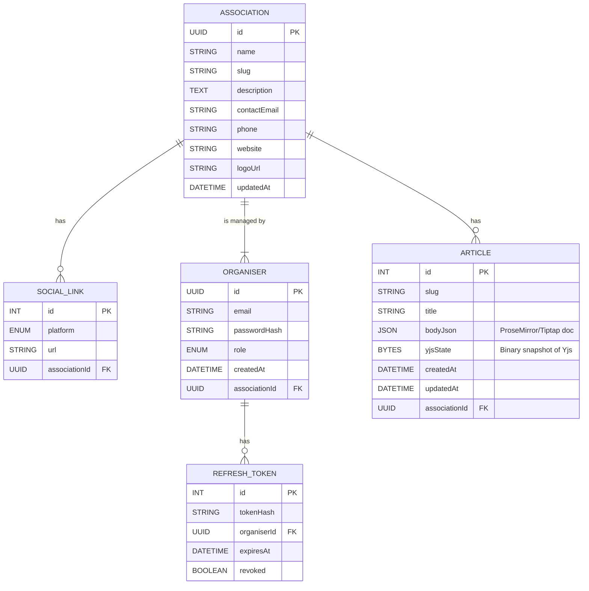

# ER Diagrams

## Snapshot‑autosave version (Tiptap + Yjs snapshot)

> **Notes**
> • `bodyJson` stores the editor’s ProseMirror/Tiptap JSON, enabling fast renders and autosave.
> • `yjsState` stores a single binary snapshot of the full Yjs document—simple but good enough for now.
> • When we switch to incremental Yjs updates, we’ll introduce an `ARTICLE_YJS_UPDATE` table instead of `yjsState`.
