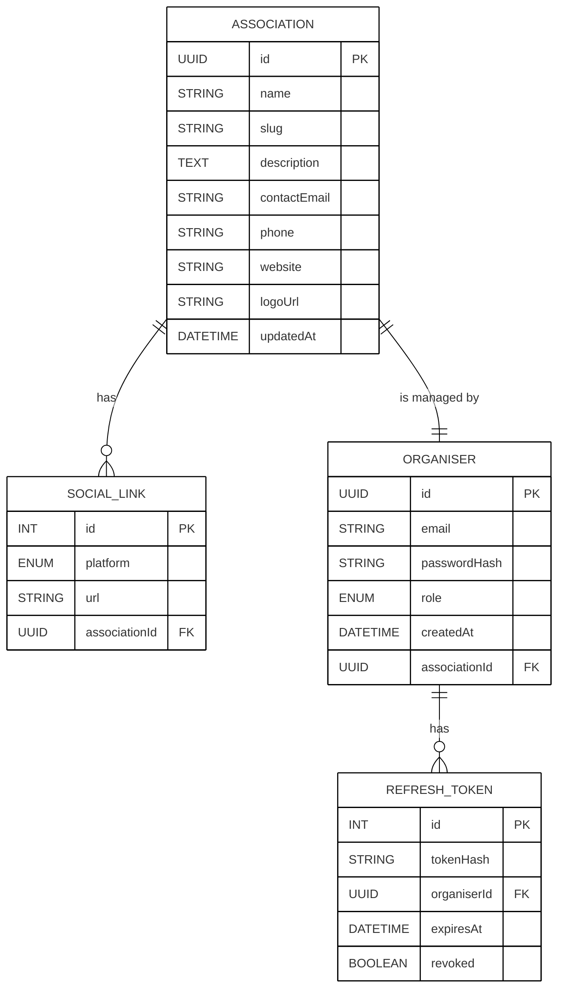
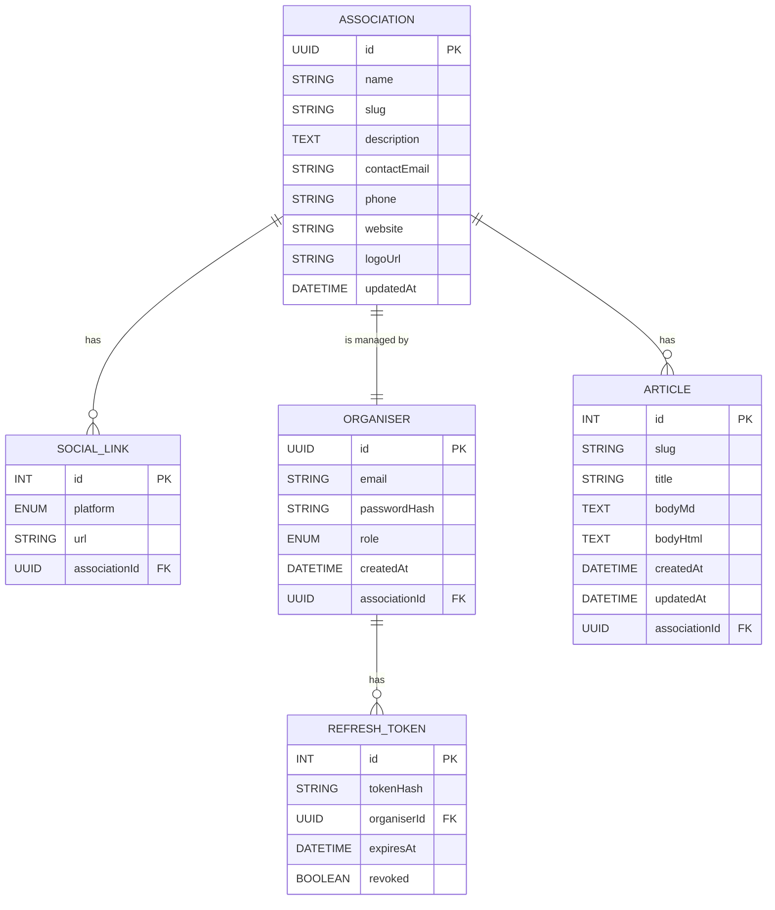

# ER Diagrams

### MVP



### Version with articles



---

## Prisma Database Schema for Convergence des Luttes

```prisma
// =======================================================
//  Prisma schema  •  SQLite
// =======================================================

datasource db {
  provider = "sqlite"
  url      = "file:./dev.db"
}

generator client {
  provider = "prisma-client-js"
}

// -------------------------
//  ENUMS
// -------------------------

enum SocialPlatform {
  WEBSITE
  TWITTER
  FACEBOOK
  INSTAGRAM
  MASTODON
  OTHER
}

enum GlobalRole {
  ORGANISER
  ADMIN
}

// -------------------------
//  MODELS
// -------------------------

model Association {
  id            String       @id @default(uuid())
  name          String       @unique
  slug          String       @unique
  description   String
  contactEmail  String
  phone         String?
  website       String?
  logoUrl       String?
  updatedAt     DateTime     @updatedAt

  // relations
  socialLinks   SocialLink[]       // 1 ──╮
  articles      Article[]          // 1 ──╯
  organiser     Organiser?         // 1 ⇄ 1 (back-reference)
}

model SocialLink {
  id             Int            @id @default(autoincrement())
  platform       SocialPlatform
  url            String
  associationId  String
  association    Association     @relation(fields: [associationId], references: [id])

  @@index([associationId])
}

model Article {
  id             Int        @id @default(autoincrement())
  slug           String     @unique
  title          String
  bodyMd         String
  bodyHtml       String?
  createdAt      DateTime   @default(now())
  updatedAt      DateTime   @updatedAt
  associationId  String
  association    Association @relation(fields: [associationId], references: [id])

  @@index([associationId])
}

model Organiser {
  id              String        @id @default(uuid())
  email           String        @unique
  passwordHash    String
  role            GlobalRole    @default(ORGANISER)
  createdAt       DateTime      @default(now())
  associationId   String        @unique            // enforces 1-to-1
  association     Association   @relation(fields: [associationId], references: [id])
  tokens          RefreshToken[]
}

model RefreshToken {
  id           Int       @id @default(autoincrement())
  tokenHash    String    @unique
  organiserId  String
  organiser    Organiser @relation(fields: [organiserId], references: [id])
  expiresAt    DateTime
  revoked      Boolean   @default(false)

  @@index([organiserId])
}
```
